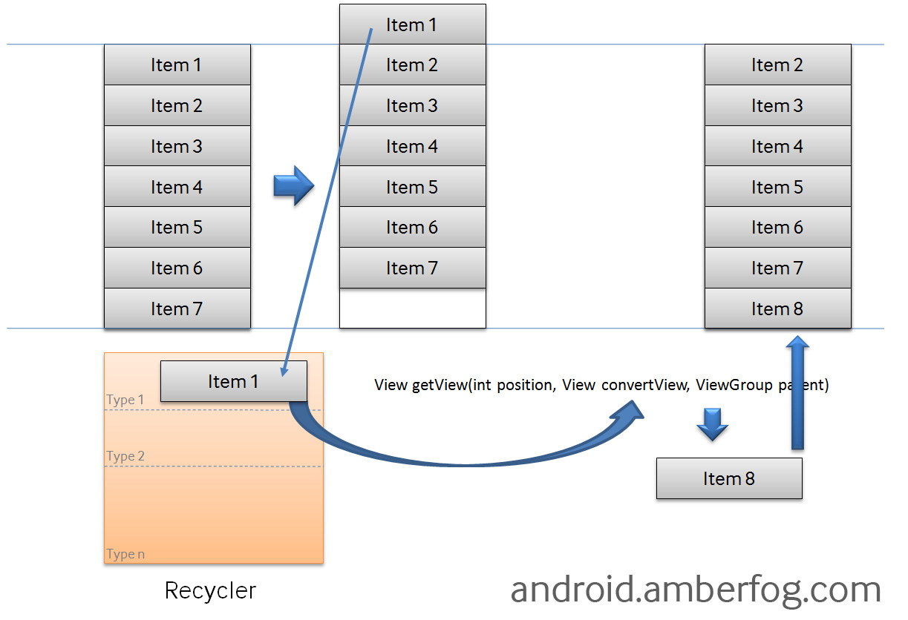

"Inflation" is a term that refers to parsing XML and turning it into UI-oriented data structures.
 ex: `setContentView(R.layout.main)`

To obtain a handle to it in your Activity, use the following snippet:

`RecyclerView rv = (RecyclerView)findViewById(R.id.rv);` 
If you are sure that the size of the RecyclerView won't be changing, you can add the following to improve performance: 
`rv.setHasFixedSize(true);`

`An adapter manages the data model and adapts it to the individual entries in the widget. It extends the RecyclerView.Adapter class and is assigned to the recycler view via the RecyclerView.setAdapter method. The input to the adapter of an recycler view can be any arbitrary Java objects. Based on this input the adapter must return the total number of items via its getItemCount() method.

The adapter prepares the layout of the items by inflating the correct layout for the individual data elements. This work is done in the onCreateViewHolder method. It returns an object of type ViewHolder per visual entry in the recycler view.

This instance is used to access the views in the inflated layout. The onCreateViewHolder method is only called then a new view must be created.

Every visible entry in a recycler view is filled with the correct data model item by the adapter. Once a data item becomes visible, the adapter assigns this data to the individual widgets which he inflated earlier. This work in done in the onBindViewHolder method.'

look here for tuts:
https://www.androidhive.info/2016/01/android-working-with-recycler-view/
https://code.tutsplus.com/tutorials/getting-started-with-recyclerview-and-cardview-on-android--cms-23465
